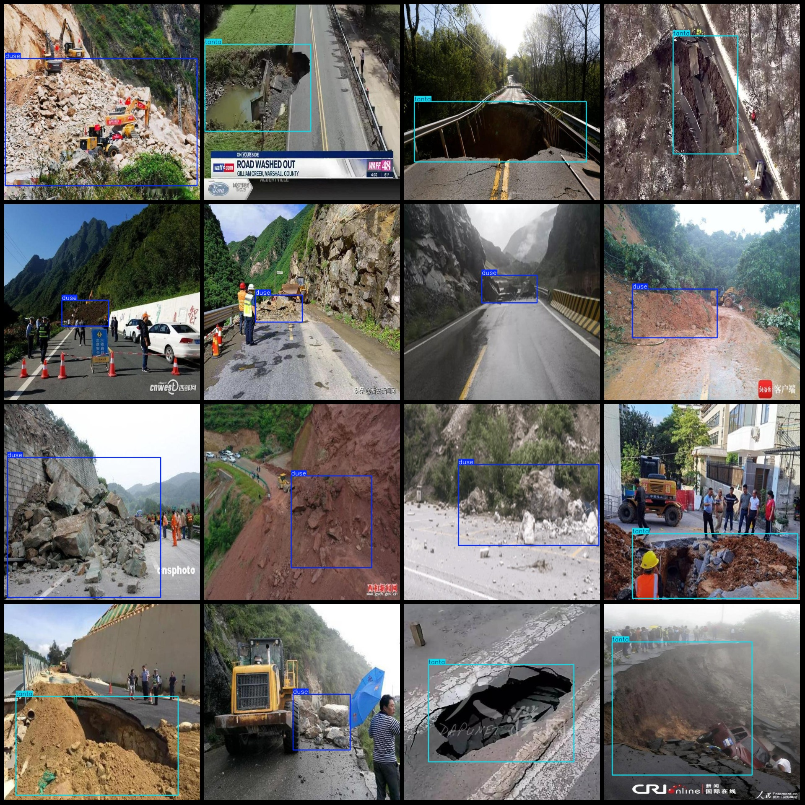
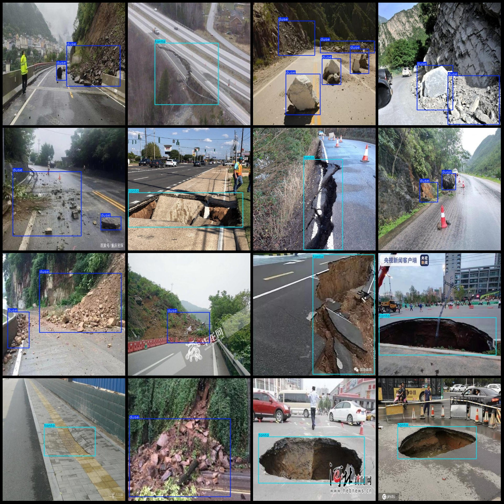

# Intelligent Transportation Roadside Demolition and Obstruction Detection Dataset (VOC+YOLO)

## Dataset Format: Pascal VOC format + YOLO format (txt files without split paths, only containing jpg images along with corresponding VOC format xml files and yolo format txt files)

### Image Count: Number of jpg files (1552)

### Annotation Count: Number of xml files (1552)

### Annotation Count: Number of txt files (1552)

### Number of Annotation Categories: 2

### Annotation Category Names: ["duse", "tanta"] (Note that the order in the yolo format does not correspond to this, but is based on the labels folder 'classes.txt')

### Boxes Count per Category:
- duse (Blockage): 1320 boxes
- tanta (Collapse): 654 boxes

Total Boxes: 1974

### Number of Images per Category:
- duse (Blockage): 937 images
- tanta (Collapse): 616 images

Image Resolution: 640x640

Usage Annotation Tool: labelImg

Annotation Rules: Draw bounding boxes for each category

Important Notice: The dataset does not have been divided into training, validation, or test sets; users must divide them independently.

Special Notice: This dataset does not guarantee the accuracy of models trained or weight files used.

Image Preview:

---

**Example of Annotations**

## Image

Here is a pay link on Stripe ( https://buy.stripe.com/3cs8yP7sY87d0vu9AB ). Please contact me lonlonago@foxmail.com after funding $89, and I will send you a complete data files , thank you!

